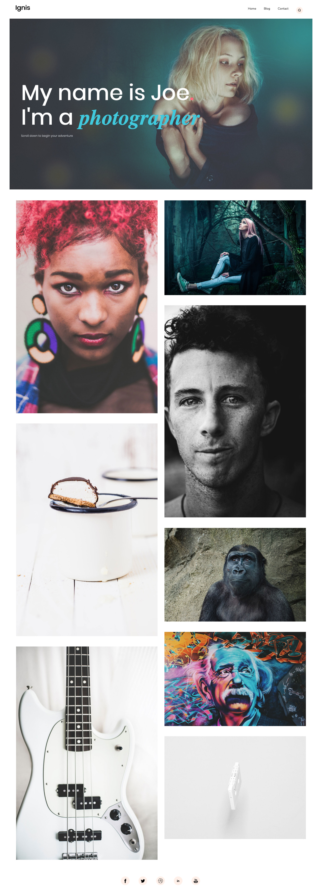

# DevelopMe_ Fellowship Coding Bootcamp - Week Two
This is the second project created at the DevelopMe_ bootcamp. It is a simple, responsive multi-page website, using HTML5 and SASS.

## Brief
The brief was to create the website from scratch, from a PDF design supplied by the instructor. The purpose of the challenge was to learn how to set up and use SASS, and how to make a website responsive using media queries.

## Features
The webpage features:
*HTML5 with relevant tags
*SASS
*Responsivity using media queries

## Screenshot

